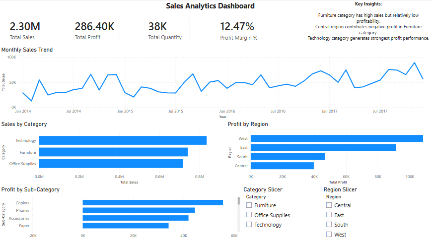

# Sales Analytics Dashboard

## 1. Project Overview

This project is an interactive Power BI dashboard designed to analyze sales, profit, and product performance using the Superstore dataset.

The dashboard helps identify:

- Sales trends over time
- Most profitable regions
- High-performing product categories
- Loss-making sub-categories
- Overall business profitability

The goal of this project is to transform raw sales data into meaningful business insights through visualization and interactive analysis.

---

## 2. Dataset

Dataset Used: Sample Superstore Dataset

The dataset contains:

- Orders
- Sales
- Profit
- Quantity
- Product Categories
- Sub-Categories
- Customer Regions
- Order Dates

The dataset is commonly used for business intelligence and Power BI practice.

---

## 3. KPIs Tracked

The dashboard includes the following key performance indicators:

- Total Sales
- Total Profit
- Total Quantity
- Profit Margin %

---

## 4. Dashboard Features

### Sales Trend Analysis
- Monthly sales trend visualization
- Helps identify sales growth patterns over time

### Category Performance Analysis
- Sales comparison across product categories
- Identifies strongest and weakest categories

### Regional Profit Analysis
- Profit comparison by region
- Highlights profitable and loss-making regions

### Sub-Category Profit Analysis
- Detailed breakdown of profitability by sub-category
- Reveals products contributing to losses

### Interactive Filtering
- Region slicer
- Category slicer

Allows dynamic dashboard exploration.

---

## 5. Key Insights

- Furniture category generates high sales but relatively low profitability.
- Central region contributes negative profit in the Furniture category.
- Tables and Bookcases are major loss-making sub-categories.
- Technology category generates the strongest profit performance.
- Profitability varies significantly across regions.

---

## 6. Dashboard Preview



---

## 7. Tools Used

- Power BI
- DAX
- Data Visualization
- Business Intelligence Concepts

---

## 8. DAX Measures Used

```DAX
Total Sales = SUM(Superstore[Sales])

Total Profit = SUM(Superstore[Profit])

Total Quantity = SUM(Superstore[Quantity])

Profit Margin % =
DIVIDE([Total Profit], [Total Sales], 0)
```

## 9. Files Included

- .pbix Power BI dashboard file
- Dataset used for analysis
- Dashboard screenshot
- README documentation

## 10. How to Use

- Download the .pbix file
- Open using Power BI Desktop
- Interact with slicers and visuals
- Explore sales and profitability insights

